# Architecture

## System Posture

The app is a private, single-owner command center. It intentionally has no public signup, no team accounts, no public portals, no client portal, and no live outreach execution. The owner is the only final approver for real-world action.

Wholesale Prime is the executive overseer. It can recommend, route, summarize, escalate, and block unsafe action. It cannot send messages, contact buyers or sellers, execute contracts, provide legal advice, or make guaranteed profit claims.

V2 adds a controlled buyer portal. The private operator system remains the source of truth, and the buyer portal is only an invite-gated, sanitized deal-room projection. There is still no public signup, no seller portal, no live buyer blasts, no payments, no legal advice, and no contract execution.

V3 adds seller acquisition and follow-up control. It turns leads into controlled seller opportunities with interaction records and draft preparation only. It still does not send SMS, email, calls, or offers, and it cannot execute contracts.

V4 adds contract control and title handoff preparation. It turns approved offer packets into internal control records, title handoff placeholders, and assignment-readiness checks without executable contract generation, live sending, title-company submission, legal advice, or automatic contract status changes.

V5 adds a controlled communication gate. It can prepare communication drafts and mock dry-runs, but any live-send path is disabled by default and must pass safety, dry-run, unchanged-draft, owner approval, provider readiness, recipient source tie, one-recipient, and idempotency gates. Bulk campaigns, buyer blasts, auto follow-up sequences, and title-company submission remain blocked.

V6 adds a controlled seller offer review room. The private operator system remains the source of truth, and seller-facing visibility is invite-gated, explicitly enabled per offer, sanitized, and blocked unless offer packet, compliance, owner approval, contract-control status, and language-safety gates pass. Seller responses are intake-only for operator review; there is no acceptance execution, negotiation automation, contract execution, file transmission, legal advice, buyer data exposure, or internal profit/spread exposure.

V7 adds a unified internal deal room and closing coordination gate. It connects seller offer room, buyer deal room, contract control, title handoff, communication drafts, compliance, and assignment readiness into one governed coordination layer. It is recommendation-only and cannot execute legal documents, submit title packages, handle payments, or automate buyer/seller negotiation.

V8 adds proof-backed deal evidence and assignment-fee attribution. It ties projected and verified assignment fees to source records instead of guesses, sanitizes internal notes from evidence summaries, and blocks fake profit claims, unsupported ROI claims, invented buyer/seller numbers, client-facing proof without approval, and legal or closing guarantees.

V9 adds buyer demand intelligence and deal distribution prep. It ranks which buyers are most likely to close fast using demand, price, POF, reliability, closing speed, deal type, and buyer margin signals, then prepares sanitized one-recipient distribution drafts without live blasts, bulk sends, fake scarcity, fake competition, or seller/private data exposure.

V10 adds controlled offer-to-contract conversion. It structures offer positioning, negotiation tracking, seller acceptance readiness scoring, and contract-ready state gating so the operator can move faster only when underwriting, profit control, buyer demand, compliance, risk, seller readiness, and owner approval all clear. Contract-ready is an internal coordination status only; it does not create or execute a contract.

V11 adds title company/attorney review coordination. It prepares draft-only review records and review packets for V10 contract-ready deals, tracks missing documents and owner approval, and blocks legal advice, contract execution, document submission, title-company email sending, attorney-client relationship claims, and closing guarantees.

V12 adds near-autonomous internal execution. Wholesale Prime and its divisions can continuously analyze, prepare, prioritize, route, schedule, escalate, and brief the operator. The default autonomy model is Level 2 for autonomous internal prep, Level 3 for autonomous draft creation and scheduling, Level 4 for controlled live-action review with owner approval only, and Level 5 disabled/unavailable. Real-world actions remain blocked unless a prior controlled gate explicitly allows owner-reviewed next steps.

V13 adds a controlled auto-execution gate for very narrow approved repeatable actions. It does not loosen V5 or V12; it requires approved rules, approved templates, safety, dry-run receipts, owner approval where needed, live flags, provider readiness, one recipient, idempotency, and audit records before a low-risk single-message path can even mock-send.

## Backend Modules

- `app/models.py`: SQLAlchemy persistence models for divisions, agents, leads, deals, buyers, matches, and compliance records.
- `app/domain/scoring.py`: lead opportunity scoring and deal speed score.
- `app/domain/profit_control.py`: MAO, max buyer purchase price, max seller offer, offer options, assignment spread, reasonableness scoring, and buyer margin flags.
- `app/domain/buyer_matching.py`: draft-only buyer match scoring by area, price, property type, reliability, closing speed, and proof of funds.
- `app/domain/buyer_portal.py`: buyer visibility publishing gate, sanitized deal-room projection, forbidden-field leak guard, and V2 portal policy.
- `app/domain/buyer_demand.py`: V9 buyer demand scoring, per-deal priority ranking, sanitized private deal sheet generation, distribution prep guard, and buyer demand dashboard aggregation.
- `app/domain/offer_conversion.py`: V10 offer positioning summaries, negotiation readiness scoring, conversion gates, deal acceleration recommendations, contract-ready state sync, and conversion safety validation.
- `app/domain/title_review.py`: V11 title/attorney review coordination gates, draft review packet summaries, missing-item queues, safety validation, and no-submission boundaries.
- `app/domain/autonomy.py`: V12 automation rule engine, scheduler runtime, run/attempt ledgers, idempotency guard, autonomous task queue, event trigger summaries, daily command briefing generation, escalation queue, and autonomy safety guard.
- `app/domain/auto_execution.py`: V13 controlled auto-execution rules, approved template safety checks, conditional execution gate, dry-run receipts, idempotent single-attempt workflow, and audit trail aggregation.
- `app/domain/seller_acquisition.py`: seller safety language guard, draft-only follow-up engine, seller pipeline command center, and offer packet prep gate.
- `app/domain/contract_control.py`: V4 contract prep gate, title handoff safety summary, assignment readiness gate, and contract/title language guard.
- `app/domain/communications.py`: V5 communication safety checks, dry-run receipts, owner approval gate, idempotency gate, blocked attempt audit, and mock email/SMS adapters.
- `app/domain/seller_portal.py`: V6 seller visibility gate, sanitized offer-room projection, response intake guard, forbidden-field leak guard, and seller portal policy.
- `app/domain/closing_coordination.py`: V7 unified deal room status sync, closing checklist readiness, blocker generation, next-best-action recommendations, and coordination dashboard aggregation.
- `app/domain/deal_evidence.py`: V8 evidence packet sync, assignment-fee attribution, source-record verification, 10K+ verification, sanitized evidence summaries, and unsupported-claim guards.
- `app/domain/rules.py`: private-mode rules and v1 action validation.
- `app/domain/compliance.py`: purchase, assignment, title, seller disclosure, buyer disclosure, and state-review checklists.
- `app/domain/imports.py`: CSV-ready lead import preview with accepted source categories.
- `app/domain/command_center.py`: daily ranking and attention queue aggregation.
- `app/seed_data.py`: realistic demo hierarchy, leads, buyers, deals, matches, and compliance examples.
- `app/api/routes.py`: read APIs and validation endpoints.

## Core Formulas

```text
max_buyer_purchase_price = ARV - repairs - buyer_costs - buyer_desired_profit
max_seller_offer = max_buyer_purchase_price - target_assignment_fee
projected_assignment_fee = buyer_purchase_price - seller_contract_price
```

The profit-control engine flags assignment spreads below target, buyer margins below desired profit, seller offers above the safe max, overly aggressive seller offers, and invalid ARV or repair inputs.

## Data Model

```mermaid
erDiagram
  DIVISION ||--o{ AGENT : manages
  LEAD ||--o{ DEAL : produces
  DEAL ||--o{ BUYER_MATCH : matches
  BUYER ||--o{ BUYER_MATCH : receives
  DEAL ||--o{ COMPLIANCE_RECORD : requires
  DEAL ||--o| BUYER_DEAL_PUBLICATION : projects
  DEAL ||--o{ BUYER_INTEREST : receives
  BUYER ||--o{ BUYER_INTEREST : records
  LEAD ||--o{ SELLER_INTERACTION : captures
  DEAL ||--o{ OFFER_PACKET : gates
  LEAD ||--o{ CONTRACT_CONTROL : controls
  DEAL ||--o{ CONTRACT_CONTROL : prepares
  OFFER_PACKET ||--o{ CONTRACT_CONTROL : authorizes
  CONTRACT_CONTROL ||--o{ TITLE_HANDOFF_PACKET : drafts
  CONTRACT_CONTROL ||--o{ ASSIGNMENT_READINESS_RECORD : checks
  DEAL ||--o{ ASSIGNMENT_READINESS_RECORD : readies
  BUYER ||--o{ ASSIGNMENT_READINESS_RECORD : verifies
  SELLER_INTERACTION ||--o{ COMMUNICATION_DRAFT : sources
  BUYER_INTEREST ||--o{ COMMUNICATION_DRAFT : sources
  TITLE_HANDOFF_PACKET ||--o{ COMMUNICATION_DRAFT : sources
  COMMUNICATION_DRAFT ||--o{ COMMUNICATION_DRY_RUN_RECEIPT : produces
  COMMUNICATION_DRY_RUN_RECEIPT ||--o{ COMMUNICATION_APPROVAL : gates
  COMMUNICATION_DRAFT ||--o{ COMMUNICATION_SEND_ATTEMPT : audits
  LEAD ||--o{ SELLER_OFFER_PUBLICATION : projects
  DEAL ||--o{ SELLER_OFFER_PUBLICATION : publishes
  OFFER_PACKET ||--o{ SELLER_OFFER_PUBLICATION : gates
  CONTRACT_CONTROL ||--o{ SELLER_OFFER_PUBLICATION : validates
  SELLER_OFFER_PUBLICATION ||--o{ SELLER_PORTAL_RESPONSE : intakes
  DEAL ||--o{ UNIFIED_DEAL_ROOM : coordinates
  CONTRACT_CONTROL ||--o{ UNIFIED_DEAL_ROOM : controls
  UNIFIED_DEAL_ROOM ||--o| CLOSING_COORDINATION_CHECKLIST : checks
  UNIFIED_DEAL_ROOM ||--o{ DEAL_ROOM_BLOCKER : blocks
  UNIFIED_DEAL_ROOM ||--o{ DEAL_EVIDENCE_PACKET : proves
  DEAL ||--o{ DEAL_EVIDENCE_PACKET : evidences
  DEAL_EVIDENCE_PACKET ||--o{ ASSIGNMENT_FEE_ATTRIBUTION : attributes
  DEAL ||--o{ ASSIGNMENT_FEE_ATTRIBUTION : calculates
  BUYER ||--o| BUYER_DEMAND_PROFILE : profiles
  DEAL ||--o{ BUYER_DEAL_PRIORITY : ranks
  BUYER ||--o{ BUYER_DEAL_PRIORITY : scores
  BUYER_DEMAND_PROFILE ||--o{ BUYER_DEAL_PRIORITY : informs
  DEAL ||--o{ DEAL_DISTRIBUTION_PREP : prepares
  BUYER ||--o{ DEAL_DISTRIBUTION_PREP : targets
  BUYER_DEAL_PRIORITY ||--o{ DEAL_DISTRIBUTION_PREP : sources
  DEAL ||--o{ OFFER_POSITIONING_RECORD : positions
  OFFER_PACKET ||--o{ OFFER_POSITIONING_RECORD : supports
  DEAL ||--o{ NEGOTIATION_RECORD : tracks
  OFFER_POSITIONING_RECORD ||--o{ NEGOTIATION_RECORD : frames
  DEAL ||--o{ CONTRACT_READY_STATE : gates
  OFFER_POSITIONING_RECORD ||--o{ CONTRACT_READY_STATE : supports
  NEGOTIATION_RECORD ||--o{ CONTRACT_READY_STATE : readies
  DEAL ||--o{ TITLE_REVIEW_COORDINATION : coordinates
  CONTRACT_READY_STATE ||--o{ TITLE_REVIEW_COORDINATION : gates
  TITLE_REVIEW_COORDINATION ||--o{ REVIEW_PACKET_PREP : prepares
  DEAL ||--o{ REVIEW_PACKET_PREP : drafts
  AUTOMATION_RULE ||--o{ SCHEDULER_RUN : schedules
  SCHEDULER_RUN ||--o{ AUTOMATION_ATTEMPT : audits
  AUTOMATION_RULE ||--o{ AUTONOMOUS_AGENT_TASK : routes
  SCHEDULER_RUN ||--o{ AUTONOMOUS_AGENT_TASK : creates
  AUTOMATION_RULE ||--o{ AUTOMATION_EVENT_TRIGGER : listens
  SCHEDULER_RUN ||--o{ DAILY_COMMAND_BRIEFING : generates
  SCHEDULER_RUN ||--o{ AUTONOMY_ESCALATION : escalates
  DEAL ||--o{ AUTONOMY_ESCALATION : raises
  LEAD ||--o{ AUTONOMY_ESCALATION : raises
  APPROVED_TEMPLATE ||--o{ AUTO_EXECUTION_RULE : authorizes
  AUTO_EXECUTION_RULE ||--o{ AUTO_EXECUTION_DRY_RUN : produces
  APPROVED_TEMPLATE ||--o{ AUTO_EXECUTION_DRY_RUN : hashes
  AUTO_EXECUTION_RULE ||--o{ AUTO_EXECUTION_ATTEMPT : gates
  AUTO_EXECUTION_DRY_RUN ||--o{ AUTO_EXECUTION_ATTEMPT : supports
  AUTO_EXECUTION_ATTEMPT ||--o{ AUTO_EXECUTION_AUDIT_RECORD : audits
```



## V2 Buyer Portal

Buyer-facing routes:

- `/buyer-portal`
- `/buyer-portal/deals`
- `/buyer-portal/deals/[dealId]`
- `/buyer-portal/profile`
- `/buyer-portal/watchlist`

The buyer portal shows only property city/state/zip, property type, beds/baths/sqft, ARV range, repair estimate range, asking price, estimated buyer margin, photo placeholders, access instructions placeholder, proof-of-funds status, deal availability status, and a draft-only offer-interest control.

The buyer portal never exposes seller identity, seller contact details, lead source, motivation score, seller temperature, seller contract price except as intentionally published asking price, assignment fee logic, projected assignment spread, max seller offer, internal notes, compliance internals, Wholesale Prime recommendations, agent queues, or manager queues.

## Publishing Gate

A deal can be buyer-visible only when all of these are true:

- Operator explicitly marked it buyer-visible
- ARV exists
- Repair estimate exists
- Asking price exists
- Compliance review is marked complete
- Seller contract is marked controlled
- Risk status is not high
- Buyer margin is not weak

The internal dashboard shows buyer-visible deals, buyer interest queue, proof-of-funds needs, owner-review offer intents, and deals blocked from buyer portal with reasons.

## V3 Seller Acquisition

Internal routes:

- `/dashboard/seller-acquisition`
- `/dashboard/seller-acquisition/[leadId]`
- `/dashboard/follow-up-control`
- `/dashboard/offer-packets`
- `/dashboard/offer-packets/[packetId]`

Seller interaction records capture call notes, motivation answers, asking price, timeline, property condition, pain points, objections, next follow-up date, seller temperature score, objection status, follow-up urgency, and next best seller action.

The follow-up engine prepares only drafts:

- Call script draft
- SMS draft
- Email draft
- Objection response draft
- Offer explanation draft
- Follow-up sequence draft

## Offer Packet Prep Gate

Offer packet prep is allowed only when all of these are true:

- ARV exists
- Repair estimate exists
- Max seller offer is calculated
- Buyer margin is protected
- Target assignment fee is checked
- Compliance guard passed
- Owner approval is recorded

The gate returns blocked reasons for missing underwriting, weak buyer margin, target assignment fee failure, missing compliance, or missing owner approval. Even when allowed, the packet remains draft-only and no real-world action is taken.

## Seller Safety Boundary

Blocked seller acquisition language and actions include pressure language, fake buyer claims, fake urgency, guaranteed closing claims, legal advice, misleading assignment language, live SMS, live email, and live calls.

## V4 Contract Control

Internal routes:

- `/dashboard/contract-control`
- `/dashboard/contract-control/[contractId]`
- `/dashboard/title-handoff`
- `/dashboard/title-handoff/[packetId]`
- `/dashboard/assignment-readiness`

Contract control records connect the lead, deal, and approved offer packet to seller accepted terms, contract status, assignment allowed flag, inspection/access notes, earnest money notes, closing timeline, title company preference, required document checklist, owner approval status, and compliance review status.

Contract prep is allowed only when all of these are true:

- Offer packet is approved
- Seller accepted terms are recorded
- ARV and repair estimate exist
- Buyer margin is protected
- Assignment spread is calculated
- Compliance guard passed
- Owner approval is recorded

Title handoff packets are preparation artifacts only. They contain property details, seller info placeholder, buyer/entity info placeholder, agreed price, closing timeline, access notes, assignment status, required document checklist, and attorney/title review reminder. V4 has no title-company submission path.

Assignment readiness is true only when contract control exists, assignment allowed is confirmed, buyer match exists, buyer proof-of-funds is verified, buyer interest is recorded, compliance review passed, and owner approval is recorded.

The V4 safety guard blocks executable contract generation, legal advice language, live email/SMS/calls, title-company submission, false assignment claims, hidden disclosure language, buyer/seller misrepresentation, and automatic contract status changes.

## V5 Communication Gate

Internal routes:

- `/dashboard/communications`
- `/dashboard/communications/[draftId]`
- `/dashboard/communications/dry-runs`
- `/dashboard/communications/attempts`
- `/dashboard/communications/approvals`

Communication draft records cover seller follow-up drafts, buyer interest response drafts, title handoff email drafts, and internal owner notes. Each draft stores recipient type, recipient email/phone placeholder, source record type/id, subject, draft body, status, safety result, owner approval status, communication live flag, provider readiness, dry-run references, and blocked reasons.

Before a dry-run or send attempt, the safety check blocks pressure language, legal advice, fake urgency, fake buyer claims, guaranteed close claims, misleading assignment language, hidden fee or deception language, missing SMS opt-out language, unsupported claims, bulk language, and campaign language.

Dry-run receipts record:

- Recipient
- Subject/body hash
- Source record
- Risk status
- Safety result
- Timestamp
- Provider mode `mock/dry_run`
- Idempotency key

The live-send gate requires all of these before a mock-send can occur:

- Draft unchanged after dry-run
- Safety passed
- Dry-run receipt exists
- Owner approval recorded
- Global live flag enabled
- Draft communication live flag enabled
- Provider readiness true
- Recipient tied to the source record
- One-send idempotency not already used
- Exactly one recipient

The provider layer contains mock email and SMS adapters only. No provider secrets are required. Blocked attempts create audit records with `provider_called = false`. Even a successful gated attempt is `mock_sent` unless a future owner-controlled provider integration is explicitly added.

V5 live-send limits:

- One recipient only
- One approved draft only
- One source record only
- No bulk send
- No campaigns
- No auto-follow-up sequence
- No buyer blast execution
- No title-company submission

## V6 Seller Portal

Seller-facing routes:

- `/seller-portal`
- `/seller-portal/offer`
- `/seller-portal/property`
- `/seller-portal/timeline`
- `/seller-portal/documents`
- `/seller-portal/messages`

The seller portal shows only approved external-facing offer information:

- Property address summary
- Offer status
- Offer amount
- Closing timeline estimate
- Inspection/access next step
- Title company review status
- Document checklist
- Owner/operator contact placeholder
- Seller question/note intake action

The seller portal never exposes buyer lists, buyer data, buyer purchase price, assignment fee, internal spread strategy, MAO logic, motivation score, seller temperature, lead source, internal notes, Wholesale Prime recommendations, compliance-risk internals, agent queues, or manager queues.

Seller visibility is allowed only when all of these are true:

- Portal visibility is explicitly enabled
- Offer packet is approved
- Compliance check passed
- Owner approval is recorded
- Contract-control status is valid
- Offer language safety passed
- Contract execution is disabled
- Live negotiation automation is disabled
- Buyer data and internal profit logic exposure are disabled

Seller response records cover seller portal notes, offer questions, appointment/access preferences, and document upload placeholders. They are always review-only: `draft_only = true`, `negotiation_execution_allowed = false`, `contract_execution_allowed = false`, and `automatic_acceptance_allowed = false`.

The internal dashboard shows seller-visible offers, seller portal questions, seller document checklist queue, seller response queue, and blocked seller visibility reasons.

## V7 Unified Deal Room

Internal routes:

- `/dashboard/deal-room`
- `/dashboard/deal-room/[dealRoomId]`
- `/dashboard/closing-coordination`
- `/dashboard/closing-coordination/blockers`
- `/dashboard/closing-coordination/readiness`

Unified deal room records connect each deal to contract control, seller portal status, buyer portal status, title handoff status, assignment readiness status, communication status, compliance status, closing timeline, blockers, next required actions, owner approval status, and projected assignment fees at risk.

The closing coordination checklist tracks:

- Seller accepted offer
- Contract prep ready
- Buyer matched
- Buyer POF verified
- Assignment allowed confirmed
- Title handoff prepared
- Inspection/access coordinated
- Seller documents requested
- Buyer intent recorded
- Compliance review complete
- Owner approval complete

The blocker engine creates internal blocker records for missing buyer POF, missing seller documents, missing compliance review, missing owner approval, weak buyer margin, high-risk language, assignment not confirmed, title handoff incomplete, and communication drafts pending.

The next-best-action engine only recommends internal actions such as reviewing seller response, verifying buyer POF, preparing title handoff, approving a communication dry-run, updating the closing timeline, resolving a compliance blocker, or reviewing assignment readiness.

The V7 safety boundary blocks legal execution, executable contract generation, title-company submission, payment handling, hidden fee/deceptive language, automatic negotiation, and automatic real-world status changes.

## V8 Evidence And Attribution

Internal routes:

- `/dashboard/deal-evidence`
- `/dashboard/deal-evidence/[packetId]`
- `/dashboard/assignment-fees`
- `/dashboard/assignment-fees/[feeId]`

Evidence packets connect a unified deal room to:

- Lead source
- Seller interaction proof
- Underwriting snapshot
- Buyer interest proof
- POF proof status
- Contract control status
- Title handoff status
- Communication receipts
- Blocker history
- Compliance review status

The evidence review gate allows evidence approval only when contract control exists, buyer interest exists, seller acceptance is recorded, compliance passed, source records are present, and no unsupported profit claims are present. Owner review is tracked separately, so a packet may be source-ready but still sit in owner review.

Assignment-fee attribution records track projected assignment fee, target assignment fee, seller contract price, buyer purchase price, buyer margin, attribution basis, confidence score, verification status, owner review status, and 10K+ verification status.

The 10K+ verified flag is true only when:

- The assignment fee equals buyer purchase price minus seller contract price
- The calculated fee meets or exceeds the target assignment fee
- The evidence packet is approved
- Required source records are present

V8 blocks fake profit claims, unsupported ROI claims, invented buyer/seller numbers, client-facing proof without approval, legal guarantees, and closing guarantees. Evidence summaries are sanitized to avoid call notes, motivation answers, pain points, objections, seller temperature, Wholesale Prime recommendations, and other internal notes.

## V9 Buyer Demand And Distribution Prep

Internal routes:

- `/dashboard/buyer-demand`
- `/dashboard/buyer-demand/[buyerId]`
- `/dashboard/buyer-priority`
- `/dashboard/deal-distribution`
- `/dashboard/deal-distribution/[distributionId]`

Buyer demand profiles track buyer activity score, zip-code demand score, property-type demand score, price-band fit, closing-speed score, proof-of-funds strength, reliability score, last-engaged date, and preferred spread/margin notes.

Buyer priority records rank buyers per deal by target area match, max price fit, POF status, past reliability, closing speed, deal type fit, and buyer margin strength. These rankings create internal recommendations only. They do not contact buyers, negotiate, execute contracts, or publish deal data.

Distribution prep records are draft-only and one-recipient scoped. They store buyer deal email drafts, SMS drafts, a sanitized private deal sheet, buyer call notes, and buyer response trackers. No live send, bulk send, campaign, auto-follow-up, buyer blast, title submission, payment handling, or contract execution is available in V9.

The buyer deal sheet sanitizer exposes only property summary, asking price, ARV range, repair estimate range, buyer margin estimate, access instructions placeholder, availability status, and proof/inspection placeholder notes.

The sanitizer hides seller name/contact, seller contract price unless intentionally represented as asking price, assignment fee logic, lead source, motivation score, internal spread logic, agent recommendations, compliance internals, Wholesale Prime recommendations, and manager queues.

The V9 safety guard blocks live buyer blasts, bulk sends, misleading scarcity, fake offers, fake buyer competition, seller/private data exposure, assignment fee exposure without approval, legal guarantees, and closing guarantees.

## V10 Offer To Contract Conversion

Internal routes:

- `/dashboard/offer-conversion`
- `/dashboard/offer-conversion/[dealId]`
- `/dashboard/negotiations`
- `/dashboard/negotiations/[recordId]`
- `/dashboard/contract-ready`

Offer positioning records capture strategy type (`cash-fast`, `as-is`, `investor-grade`, or `flexible-close`), seller pain alignment, justification summary, anchor price, walk-away price, ideal contract price, concession range, negotiation notes, confidence score, owner approval status, and safety status.

Negotiation records track seller last response, objections, counteroffer, emotional signals, negotiation stage, next move recommendation, and the acceptance readiness inputs:

- Motivation score
- Price alignment
- Timeline alignment
- Trust level
- Objection resolution
- Contact consistency

The acceptance readiness engine returns low readiness, medium readiness, high readiness, or contract-ready. The contract-ready level requires a high readiness score plus a stabilized stage such as soft-accepted or verbally accepted.

The offer conversion gate allows a contract-ready internal state only when all of these are true:

- Underwriting complete
- Profit control validated
- Buyer demand confirmed
- Compliance passed
- No risk flags
- Seller readiness high
- Owner approval recorded

The contract-ready state means the deal is ready for external contract drafting by attorney/title resources, the seller is likely to sign, numbers are locked, and negotiation is stabilized. It does not create a contract, execute a contract, auto-accept an offer, submit anything to title, or negotiate with the seller.

The deal acceleration engine only recommends internal next moves such as sending an updated offer explanation draft, handling a specific objection, adjusting price within the safe range, moving toward verbal agreement, holding position, or disengaging.

The V10 safety guard blocks legal advice, executable contract generation, automatic acceptance, pressure tactics, fake urgency, fake buyer claims, guaranteed close language, misleading assignment language, deception about role or assignment, and live negotiation automation.

## V11 Title Attorney Review Coordination

Internal routes:

- `/dashboard/title-review`
- `/dashboard/title-review/[reviewId]`
- `/dashboard/review-packets`

Review coordination records track:

- Deal
- V10 contract-ready status
- Selected title company placeholder
- Attorney/title review status
- Required documents
- Missing items
- Review notes
- Owner approval status

Review packet prep is draft-only and organizes:

- Property summary
- Seller terms
- Buyer/assignment readiness summary
- Closing timeline
- Access notes
- Compliance checklist
- Document checklist

The V11 review packet gate allows prep only when all of these are true:

- V10 contract-ready state is cleared
- Compliance passed
- Owner approval recorded
- Numbers locked
- Seller acceptance readiness is high or contract-ready

Even when the gate passes, the review packet is only an internal preparation artifact. It cannot submit documents, email a title company, create or execute a contract, provide legal advice, claim an attorney-client relationship, or guarantee closing.

## V12 Near-Autonomous Execution

Internal routes:

- `/dashboard/autonomy`
- `/dashboard/autonomy/rules`
- `/dashboard/autonomy/runs`
- `/dashboard/autonomy/tasks`
- `/dashboard/autonomy/daily-briefing`
- `/dashboard/autonomy/escalations`

Automation rules define workflow type, autonomy level, trigger event, allowed prep actions, blocked real-world actions, schedule label, owner approval requirement, and safety status.

The scheduler runtime supports these workflows:

- New Lead Intake
- Hot Deal Acceleration
- Buyer Demand Refresh
- Contract Readiness
- Daily Command Briefing

Each scheduler run records idempotency, workflow status, created tasks, attempts, escalation creation, briefing creation, owner approval requirements, autonomy level, and whether any real-world action was taken. V12 always records `real_world_action_taken = false`.

Attempt ledgers record prepared internal actions and blocked real-world attempts. Blocked attempts store action type, source record, blocked reasons, provider-call status, owner approval status, and safety result. Provider calls remain false for blocked attempts.

Autonomous agent tasks route work to divisions and agents for lead scoring, priority queues, seller follow-up drafts, buyer distribution drafts, offer packet drafts, evidence packets, blocker records, contract readiness checks, and daily briefings. Tasks are recommendations or draft preparation only.

Event triggers capture source events such as lead import, hot deal score, buyer demand refresh, gate pass, and daily schedule. Triggers can create runs but cannot publish portals, submit title packets, execute contracts, send messages, contact buyers/sellers, change terms, collect payments, or make commitments.

Daily command briefings are generated by Wholesale Prime and contain hot deals, priority actions, manager queues, escalations, owner review items, and safety summary. They are internal recommendations only.

Escalations flag urgent owner-review items such as hot 10K+ opportunities, compliance blockers, POF gaps, missing approvals, title blockers, and communication risk. Escalation records never perform the action they recommend.

The autonomy safety guard blocks:

- Autonomous SMS, email, calls, buyer contact, buyer blasts, bulk sends, and campaigns
- Autonomous contract execution, executable contract generation, or binding commitments
- Autonomous title-company submission or review packet submission
- Autonomous buyer/seller portal publishing
- Autonomous payment collection
- Autonomous seller/buyer term changes
- Legal advice
- Level 5 autonomy

Level 4 is owner-approval-required and still cannot bypass the specific communication, portal, title, contract, payment, or compliance gates.

## V13 Controlled Auto-Execution

Internal routes:

- `/dashboard/auto-execution`
- `/dashboard/auto-execution/rules`
- `/dashboard/auto-execution/templates`
- `/dashboard/auto-execution/dry-runs`
- `/dashboard/auto-execution/attempts`
- `/dashboard/auto-execution/audit`

Auto-execution rule records store rule name, action type, source type, allowed recipient type, trigger, required conditions, approved template, autonomy level, live flag requirements, risk score, owner approval status, status, and blocked reasons.

Approved templates cover seller follow-up templates, buyer response templates, internal reminder templates, title/review coordination templates, opt-out-safe SMS templates, and email templates. Template safety blocks pressure language, fake urgency, fake buyer claims, legal advice, contract execution language, hidden assignment fee deception, unsupported claims, and missing SMS opt-out language.

The conditional execution workflow is:

```text
trigger -> template match -> safety check -> dry run -> approval check -> live flag check -> provider readiness -> single execution attempt -> audit record
```

Allowed V13 actions:

- Internal reminders
- Operator task creation
- Approved seller follow-up drafts
- Approved buyer response drafts
- Approved low-risk single-message sends only when V5 gates pass

Blocked V13 actions:

- Bulk campaigns
- Buyer blasts
- Cold SMS automation
- Legal or contract messages
- Seller pressure language
- Fake urgency
- Fake buyer claims
- Any action without an approved rule and approved template

Auto-execution attempts are one-recipient and one-source-record scoped. Idempotency prevents duplicate sends, and every attempt creates an audit record with outcome, blocked reasons, safety snapshot, provider-call status, and source record.

## Frontend Routes

All requested dashboard routes are implemented under `frontend/src/app/dashboard`, including dynamic detail pages:

- `/dashboard`
- `/dashboard/command-center`
- `/dashboard/command-hierarchy`
- `/dashboard/overseer`
- `/dashboard/divisions`
- `/dashboard/divisions/[divisionId]`
- `/dashboard/managers`
- `/dashboard/manager-queue`
- `/dashboard/agents`
- `/dashboard/agents/[agentId]`
- `/dashboard/leads`
- `/dashboard/leads/[leadId]`
- `/dashboard/deals`
- `/dashboard/deals/[dealId]`
- `/dashboard/underwriting`
- `/dashboard/profit-control`
- `/dashboard/seller-acquisition`
- `/dashboard/seller-acquisition/[leadId]`
- `/dashboard/seller-followups`
- `/dashboard/follow-up-control`
- `/dashboard/offer-packets`
- `/dashboard/offer-packets/[packetId]`
- `/dashboard/contract-control`
- `/dashboard/contract-control/[contractId]`
- `/dashboard/title-handoff`
- `/dashboard/title-handoff/[packetId]`
- `/dashboard/assignment-readiness`
- `/dashboard/communications`
- `/dashboard/communications/[draftId]`
- `/dashboard/communications/dry-runs`
- `/dashboard/communications/attempts`
- `/dashboard/communications/approvals`
- `/dashboard/deal-room`
- `/dashboard/deal-room/[dealRoomId]`
- `/dashboard/closing-coordination`
- `/dashboard/closing-coordination/blockers`
- `/dashboard/closing-coordination/readiness`
- `/dashboard/deal-evidence`
- `/dashboard/deal-evidence/[packetId]`
- `/dashboard/assignment-fees`
- `/dashboard/assignment-fees/[feeId]`
- `/dashboard/buyer-demand`
- `/dashboard/buyer-demand/[buyerId]`
- `/dashboard/buyer-priority`
- `/dashboard/deal-distribution`
- `/dashboard/deal-distribution/[distributionId]`
- `/dashboard/offer-conversion`
- `/dashboard/offer-conversion/[dealId]`
- `/dashboard/negotiations`
- `/dashboard/negotiations/[recordId]`
- `/dashboard/contract-ready`
- `/dashboard/title-review`
- `/dashboard/title-review/[reviewId]`
- `/dashboard/review-packets`
- `/dashboard/autonomy`
- `/dashboard/autonomy/rules`
- `/dashboard/autonomy/runs`
- `/dashboard/autonomy/tasks`
- `/dashboard/autonomy/daily-briefing`
- `/dashboard/autonomy/escalations`
- `/dashboard/auto-execution`
- `/dashboard/auto-execution/rules`
- `/dashboard/auto-execution/templates`
- `/dashboard/auto-execution/dry-runs`
- `/dashboard/auto-execution/attempts`
- `/dashboard/auto-execution/audit`

Seller-facing V6 routes are implemented under `frontend/src/app/seller-portal`:

- `/seller-portal`
- `/seller-portal/offer`
- `/seller-portal/property`
- `/seller-portal/timeline`
- `/seller-portal/documents`
- `/seller-portal/messages`
- `/dashboard/buyers`
- `/dashboard/buyers/[buyerId]`
- `/dashboard/buyer-matches`
- `/dashboard/compliance`
- `/dashboard/daily-briefing`

## Guardrails

Blocked in v1:

- Live SMS, email, calls, buyer contact, buyer blast execution
- Paid API calls and skip tracing
- Contract execution
- Legal advice language
- Guaranteed profit claims
- Misrepresentation or hidden assignment fee language
- Public signup and public portals

V2 exception: the controlled buyer portal is allowed only as an invite-gated sanitized deal room. Client portals remain blocked.

V3 exception: seller acquisition drafting is allowed only inside the private command center. Live seller outreach remains blocked.

V4 exception: contract/title preparation is allowed only as draft records, checklists, placeholders, and readiness scoring. Executable contracts, title-company submission, and automatic status changes remain blocked.

V5 exception: communication attempts are allowed only through the controlled gate and default to blocked because the global live flag is off. Dry-runs and blocked attempts are auditable, provider adapters are mock-only, and bulk/campaign/title/buyer-blast paths remain blocked.

V6 exception: the controlled seller portal is allowed only as an invite-gated sanitized offer review room. It can receive draft/intake responses for operator review, but it cannot execute acceptance, negotiate, transmit documents, expose buyer/profit/internal strategy, or provide legal advice.

V7 exception: unified deal rooms are allowed only as internal coordination records. They can show blocker queues, next recommended actions, projected fees at risk, and readiness status inside the operator dashboard, but they cannot execute legal documents, submit title packets, process payments, auto-negotiate, or expose internal data to buyer/seller portals.

V8 exception: evidence and attribution records are allowed only as internal proof and verification records. They can show source-backed fee math, evidence gaps, missing owner review, and verified 10K+ opportunities inside the operator dashboard, but they cannot publish client-facing proof, invent profit support, guarantee ROI, guarantee closing, or expose unsanitized internal notes.

V9 exception: buyer demand and distribution prep records are allowed only as internal ranking and draft-preparation records. They can rank likely buyers, prepare one-recipient drafts, and generate sanitized deal sheets, but they cannot send blasts, send bulk messages, claim fake scarcity or buyer competition, expose seller/private data, expose internal spread logic, guarantee closing, or execute contracts.

V10 exception: offer-to-contract conversion records are allowed only as internal offer positioning, negotiation tracking, readiness scoring, and contract-ready coordination records. They can recommend next moves and mark a deal ready for external attorney/title drafting when gates pass, but they cannot create executable contracts, auto-accept terms, provide legal advice, pressure sellers, fake urgency or buyer demand, guarantee closing, or automate live negotiation.

V11 exception: title/attorney review records and review packets are allowed only as internal draft coordination artifacts. They can track title placeholders, required documents, missing items, compliance checklists, and owner approval, but they cannot submit documents, send title-company email, execute contracts, give legal advice, claim an attorney-client relationship, or guarantee closing.

V12 exception: near-autonomous execution is allowed only for internal scoring, routing, scheduling, draft creation, blocker/evidence creation, readiness marking when existing gates pass, daily briefings, and escalation records. It cannot autonomously send messages, contact buyers or sellers, publish portal data, execute contracts, submit title packets, collect payments, change deal terms, provide legal advice, make commitments, or use Level 5 autonomy. Level 4 remains owner-approval-required and subordinate to every underlying gate.

V13 exception: controlled auto-execution can complete internal reminders and task creation, prepare approved drafts, and mock-send a low-risk single message only when an approved rule, approved template, V5 safety, V5 dry-run receipt, V5 approval, live flags, provider readiness, single-recipient limit, idempotency, and audit creation all pass. It cannot send bulk campaigns, buyer blasts, cold SMS automation, legal/contract messages, pressure language, fake urgency, fake buyer claims, or any unapproved rule/template action.

Allowed:

- Analysis
- Scoring
- Drafting
- Recommendations
- Escalations
- Risk flags
- Checklist preparation

## Migration Strategy

The initial Alembic revision creates the SQLAlchemy metadata-defined schema. The backend defaults to SQLite for local operator use and switches to Postgres when `DATABASE_URL` points to a Postgres database.
