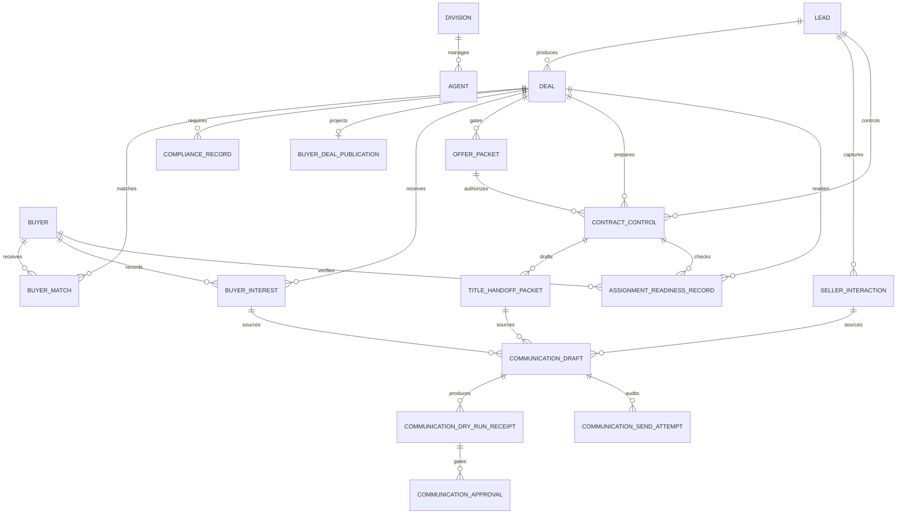

# Architecture

## System Posture

The app is a private, single-owner command center. It intentionally has no public signup, no team accounts, no seller portal, no client portal, and no live outreach execution. The owner is the only final approver for real-world action.

Wholesale Prime is the executive overseer. It can recommend, route, summarize, escalate, and block unsafe action. It cannot send messages, contact buyers or sellers, execute contracts, provide legal advice, or make guaranteed profit claims.

V2 adds a controlled buyer portal. The private operator system remains the source of truth, and the buyer portal is only an invite-gated, sanitized deal-room projection. There is still no public signup, no seller portal, no live buyer blasts, no payments, no legal advice, and no contract execution.

V3 adds seller acquisition and follow-up control. It turns leads into controlled seller opportunities with interaction records and draft preparation only. It still does not send SMS, email, calls, or offers, and it cannot execute contracts.

V4 adds contract control and title handoff preparation. It turns approved offer packets into internal control records, title handoff placeholders, and assignment-readiness checks without executable contract generation, live sending, title-company submission, legal advice, or automatic contract status changes.

V5 adds a controlled communication gate. It can prepare communication drafts and mock dry-runs, but any live-send path is disabled by default and must pass safety, dry-run, unchanged-draft, owner approval, provider readiness, recipient source tie, one-recipient, and idempotency gates. Bulk campaigns, buyer blasts, auto follow-up sequences, and title-company submission remain blocked.

## Backend Modules

- `app/models.py`: SQLAlchemy persistence models for divisions, agents, leads, deals, buyers, matches, and compliance records.
- `app/domain/scoring.py`: lead opportunity scoring and deal speed score.
- `app/domain/profit_control.py`: MAO, max buyer purchase price, max seller offer, offer options, assignment spread, reasonableness scoring, and buyer margin flags.
- `app/domain/buyer_matching.py`: draft-only buyer match scoring by area, price, property type, reliability, closing speed, and proof of funds.
- `app/domain/buyer_portal.py`: buyer visibility publishing gate, sanitized deal-room projection, forbidden-field leak guard, and V2 portal policy.
- `app/domain/seller_acquisition.py`: seller safety language guard, draft-only follow-up engine, seller pipeline command center, and offer packet prep gate.
- `app/domain/contract_control.py`: V4 contract prep gate, title handoff safety summary, assignment readiness gate, and contract/title language guard.
- `app/domain/communications.py`: V5 communication safety checks, dry-run receipts, owner approval gate, idempotency gate, blocked attempt audit, and mock email/SMS adapters.
- `app/domain/rules.py`: private-mode rules and v1 action validation.
- `app/domain/compliance.py`: purchase, assignment, title, seller disclosure, buyer disclosure, and state-review checklists.
- `app/domain/imports.py`: CSV-ready lead import preview with accepted source categories.
- `app/domain/command_center.py`: daily ranking and attention queue aggregation.
- `app/seed_data.py`: realistic demo hierarchy, leads, buyers, deals, matches, and compliance examples.
- `app/api/routes.py`: read APIs and validation endpoints.

## Core Formulas

```text
max_buyer_purchase_price = ARV - repairs - buyer_costs - buyer_desired_profit
max_seller_offer = max_buyer_purchase_price - target_assignment_fee
projected_assignment_fee = buyer_purchase_price - seller_contract_price
```

The profit-control engine flags assignment spreads below target, buyer margins below desired profit, seller offers above the safe max, overly aggressive seller offers, and invalid ARV or repair inputs.

## Data Model



## V2 Buyer Portal

Buyer-facing routes:

- `/buyer-portal`
- `/buyer-portal/deals`
- `/buyer-portal/deals/[dealId]`
- `/buyer-portal/profile`
- `/buyer-portal/watchlist`

The buyer portal shows only property city/state/zip, property type, beds/baths/sqft, ARV range, repair estimate range, asking price, estimated buyer margin, photo placeholders, access instructions placeholder, proof-of-funds status, deal availability status, and a draft-only offer-interest control.

The buyer portal never exposes seller identity, seller contact details, lead source, motivation score, seller temperature, seller contract price except as intentionally published asking price, assignment fee logic, projected assignment spread, max seller offer, internal notes, compliance internals, Wholesale Prime recommendations, agent queues, or manager queues.

## Publishing Gate

A deal can be buyer-visible only when all of these are true:

- Operator explicitly marked it buyer-visible
- ARV exists
- Repair estimate exists
- Asking price exists
- Compliance review is marked complete
- Seller contract is marked controlled
- Risk status is not high
- Buyer margin is not weak

The internal dashboard shows buyer-visible deals, buyer interest queue, proof-of-funds needs, owner-review offer intents, and deals blocked from buyer portal with reasons.

## V3 Seller Acquisition

Internal routes:

- `/dashboard/seller-acquisition`
- `/dashboard/seller-acquisition/[leadId]`
- `/dashboard/follow-up-control`
- `/dashboard/offer-packets`
- `/dashboard/offer-packets/[packetId]`

Seller interaction records capture call notes, motivation answers, asking price, timeline, property condition, pain points, objections, next follow-up date, seller temperature score, objection status, follow-up urgency, and next best seller action.

The follow-up engine prepares only drafts:

- Call script draft
- SMS draft
- Email draft
- Objection response draft
- Offer explanation draft
- Follow-up sequence draft

## Offer Packet Prep Gate

Offer packet prep is allowed only when all of these are true:

- ARV exists
- Repair estimate exists
- Max seller offer is calculated
- Buyer margin is protected
- Target assignment fee is checked
- Compliance guard passed
- Owner approval is recorded

The gate returns blocked reasons for missing underwriting, weak buyer margin, target assignment fee failure, missing compliance, or missing owner approval. Even when allowed, the packet remains draft-only and no real-world action is taken.

## Seller Safety Boundary

Blocked seller acquisition language and actions include pressure language, fake buyer claims, fake urgency, guaranteed closing claims, legal advice, misleading assignment language, live SMS, live email, and live calls.

## V4 Contract Control

Internal routes:

- `/dashboard/contract-control`
- `/dashboard/contract-control/[contractId]`
- `/dashboard/title-handoff`
- `/dashboard/title-handoff/[packetId]`
- `/dashboard/assignment-readiness`

Contract control records connect the lead, deal, and approved offer packet to seller accepted terms, contract status, assignment allowed flag, inspection/access notes, earnest money notes, closing timeline, title company preference, required document checklist, owner approval status, and compliance review status.

Contract prep is allowed only when all of these are true:

- Offer packet is approved
- Seller accepted terms are recorded
- ARV and repair estimate exist
- Buyer margin is protected
- Assignment spread is calculated
- Compliance guard passed
- Owner approval is recorded

Title handoff packets are preparation artifacts only. They contain property details, seller info placeholder, buyer/entity info placeholder, agreed price, closing timeline, access notes, assignment status, required document checklist, and attorney/title review reminder. V4 has no title-company submission path.

Assignment readiness is true only when contract control exists, assignment allowed is confirmed, buyer match exists, buyer proof-of-funds is verified, buyer interest is recorded, compliance review passed, and owner approval is recorded.

The V4 safety guard blocks executable contract generation, legal advice language, live email/SMS/calls, title-company submission, false assignment claims, hidden disclosure language, buyer/seller misrepresentation, and automatic contract status changes.

## V5 Communication Gate

Internal routes:

- `/dashboard/communications`
- `/dashboard/communications/[draftId]`
- `/dashboard/communications/dry-runs`
- `/dashboard/communications/attempts`
- `/dashboard/communications/approvals`

Communication draft records cover seller follow-up drafts, buyer interest response drafts, title handoff email drafts, and internal owner notes. Each draft stores recipient type, recipient email/phone placeholder, source record type/id, subject, draft body, status, safety result, owner approval status, communication live flag, provider readiness, dry-run references, and blocked reasons.

Before a dry-run or send attempt, the safety check blocks pressure language, legal advice, fake urgency, fake buyer claims, guaranteed close claims, misleading assignment language, hidden fee or deception language, missing SMS opt-out language, unsupported claims, bulk language, and campaign language.

Dry-run receipts record:

- Recipient
- Subject/body hash
- Source record
- Risk status
- Safety result
- Timestamp
- Provider mode `mock/dry_run`
- Idempotency key

The live-send gate requires all of these before a mock-send can occur:

- Draft unchanged after dry-run
- Safety passed
- Dry-run receipt exists
- Owner approval recorded
- Global live flag enabled
- Draft communication live flag enabled
- Provider readiness true
- Recipient tied to the source record
- One-send idempotency not already used
- Exactly one recipient

The provider layer contains mock email and SMS adapters only. No provider secrets are required. Blocked attempts create audit records with `provider_called = false`. Even a successful gated attempt is `mock_sent` unless a future owner-controlled provider integration is explicitly added.

V5 live-send limits:

- One recipient only
- One approved draft only
- One source record only
- No bulk send
- No campaigns
- No auto-follow-up sequence
- No buyer blast execution
- No title-company submission

## Frontend Routes

All requested dashboard routes are implemented under `frontend/src/app/dashboard`, including dynamic detail pages:

- `/dashboard`
- `/dashboard/command-center`
- `/dashboard/command-hierarchy`
- `/dashboard/overseer`
- `/dashboard/divisions`
- `/dashboard/divisions/[divisionId]`
- `/dashboard/managers`
- `/dashboard/manager-queue`
- `/dashboard/agents`
- `/dashboard/agents/[agentId]`
- `/dashboard/leads`
- `/dashboard/leads/[leadId]`
- `/dashboard/deals`
- `/dashboard/deals/[dealId]`
- `/dashboard/underwriting`
- `/dashboard/profit-control`
- `/dashboard/seller-acquisition`
- `/dashboard/seller-acquisition/[leadId]`
- `/dashboard/seller-followups`
- `/dashboard/follow-up-control`
- `/dashboard/offer-packets`
- `/dashboard/offer-packets/[packetId]`
- `/dashboard/contract-control`
- `/dashboard/contract-control/[contractId]`
- `/dashboard/title-handoff`
- `/dashboard/title-handoff/[packetId]`
- `/dashboard/assignment-readiness`
- `/dashboard/communications`
- `/dashboard/communications/[draftId]`
- `/dashboard/communications/dry-runs`
- `/dashboard/communications/attempts`
- `/dashboard/communications/approvals`
- `/dashboard/buyers`
- `/dashboard/buyers/[buyerId]`
- `/dashboard/buyer-matches`
- `/dashboard/compliance`
- `/dashboard/daily-briefing`

## Guardrails

Blocked in v1:

- Live SMS, email, calls, buyer contact, buyer blast execution
- Paid API calls and skip tracing
- Contract execution
- Legal advice language
- Guaranteed profit claims
- Misrepresentation or hidden assignment fee language
- Public signup and all portals

V2 exception: the controlled buyer portal is allowed only as an invite-gated sanitized deal room. Seller and client portals remain blocked.

V3 exception: seller acquisition drafting is allowed only inside the private command center. Live seller outreach remains blocked.

V4 exception: contract/title preparation is allowed only as draft records, checklists, placeholders, and readiness scoring. Executable contracts, title-company submission, and automatic status changes remain blocked.

V5 exception: communication attempts are allowed only through the controlled gate and default to blocked because the global live flag is off. Dry-runs and blocked attempts are auditable, provider adapters are mock-only, and bulk/campaign/title/buyer-blast paths remain blocked.

Allowed:

- Analysis
- Scoring
- Drafting
- Recommendations
- Escalations
- Risk flags
- Checklist preparation

## Migration Strategy

The initial Alembic revision creates the SQLAlchemy metadata-defined schema. The backend defaults to SQLite for local operator use and switches to Postgres when `DATABASE_URL` points to a Postgres database.
