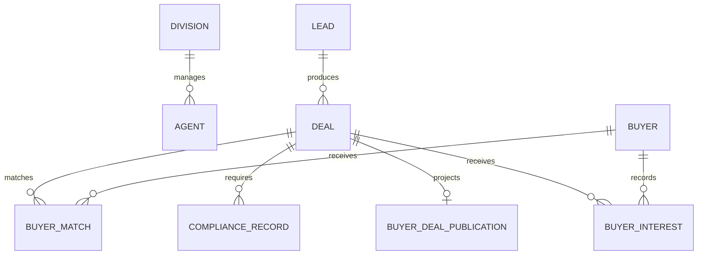

# Architecture

## System Posture

The app is a private, single-owner command center. It intentionally has no public signup, no team accounts, no seller portal, no client portal, and no live outreach execution. The owner is the only final approver for real-world action.

Wholesale Prime is the executive overseer. It can recommend, route, summarize, escalate, and block unsafe action. It cannot send messages, contact buyers or sellers, execute contracts, provide legal advice, or make guaranteed profit claims.

V2 adds a controlled buyer portal. The private operator system remains the source of truth, and the buyer portal is only an invite-gated, sanitized deal-room projection. There is still no public signup, no seller portal, no live buyer blasts, no payments, no legal advice, and no contract execution.

## Backend Modules

- `app/models.py`: SQLAlchemy persistence models for divisions, agents, leads, deals, buyers, matches, and compliance records.
- `app/domain/scoring.py`: lead opportunity scoring and deal speed score.
- `app/domain/profit_control.py`: MAO, max buyer purchase price, max seller offer, offer options, assignment spread, reasonableness scoring, and buyer margin flags.
- `app/domain/buyer_matching.py`: draft-only buyer match scoring by area, price, property type, reliability, closing speed, and proof of funds.
- `app/domain/buyer_portal.py`: buyer visibility publishing gate, sanitized deal-room projection, forbidden-field leak guard, and V2 portal policy.
- `app/domain/rules.py`: private-mode rules and v1 action validation.
- `app/domain/compliance.py`: purchase, assignment, title, seller disclosure, buyer disclosure, and state-review checklists.
- `app/domain/imports.py`: CSV-ready lead import preview with accepted source categories.
- `app/domain/command_center.py`: daily ranking and attention queue aggregation.
- `app/seed_data.py`: realistic demo hierarchy, leads, buyers, deals, matches, and compliance examples.
- `app/api/routes.py`: read APIs and validation endpoints.

## Core Formulas

```text
max_buyer_purchase_price = ARV - repairs - buyer_costs - buyer_desired_profit
max_seller_offer = max_buyer_purchase_price - target_assignment_fee
projected_assignment_fee = buyer_purchase_price - seller_contract_price
```

The profit-control engine flags assignment spreads below target, buyer margins below desired profit, seller offers above the safe max, overly aggressive seller offers, and invalid ARV or repair inputs.

## Data Model



## V2 Buyer Portal

Buyer-facing routes:

- `/buyer-portal`
- `/buyer-portal/deals`
- `/buyer-portal/deals/[dealId]`
- `/buyer-portal/profile`
- `/buyer-portal/watchlist`

The buyer portal shows only property city/state/zip, property type, beds/baths/sqft, ARV range, repair estimate range, asking price, estimated buyer margin, photo placeholders, access instructions placeholder, proof-of-funds status, deal availability status, and a draft-only offer-interest control.

The buyer portal never exposes seller identity, seller contact details, lead source, motivation score, seller temperature, seller contract price except as intentionally published asking price, assignment fee logic, projected assignment spread, max seller offer, internal notes, compliance internals, Wholesale Prime recommendations, agent queues, or manager queues.

## Publishing Gate

A deal can be buyer-visible only when all of these are true:

- Operator explicitly marked it buyer-visible
- ARV exists
- Repair estimate exists
- Asking price exists
- Compliance review is marked complete
- Seller contract is marked controlled
- Risk status is not high
- Buyer margin is not weak

The internal dashboard shows buyer-visible deals, buyer interest queue, proof-of-funds needs, owner-review offer intents, and deals blocked from buyer portal with reasons.

## Frontend Routes

All requested dashboard routes are implemented under `frontend/src/app/dashboard`, including dynamic detail pages:

- `/dashboard`
- `/dashboard/command-center`
- `/dashboard/command-hierarchy`
- `/dashboard/overseer`
- `/dashboard/divisions`
- `/dashboard/divisions/[divisionId]`
- `/dashboard/managers`
- `/dashboard/manager-queue`
- `/dashboard/agents`
- `/dashboard/agents/[agentId]`
- `/dashboard/leads`
- `/dashboard/leads/[leadId]`
- `/dashboard/deals`
- `/dashboard/deals/[dealId]`
- `/dashboard/underwriting`
- `/dashboard/profit-control`
- `/dashboard/seller-followups`
- `/dashboard/buyers`
- `/dashboard/buyers/[buyerId]`
- `/dashboard/buyer-matches`
- `/dashboard/compliance`
- `/dashboard/daily-briefing`

## Guardrails

Blocked in v1:

- Live SMS, email, calls, buyer contact, buyer blast execution
- Paid API calls and skip tracing
- Contract execution
- Legal advice language
- Guaranteed profit claims
- Misrepresentation or hidden assignment fee language
- Public signup and all portals

V2 exception: the controlled buyer portal is allowed only as an invite-gated sanitized deal room. Seller and client portals remain blocked.

Allowed:

- Analysis
- Scoring
- Drafting
- Recommendations
- Escalations
- Risk flags
- Checklist preparation

## Migration Strategy

The initial Alembic revision creates the SQLAlchemy metadata-defined schema. The backend defaults to SQLite for local operator use and switches to Postgres when `DATABASE_URL` points to a Postgres database.
